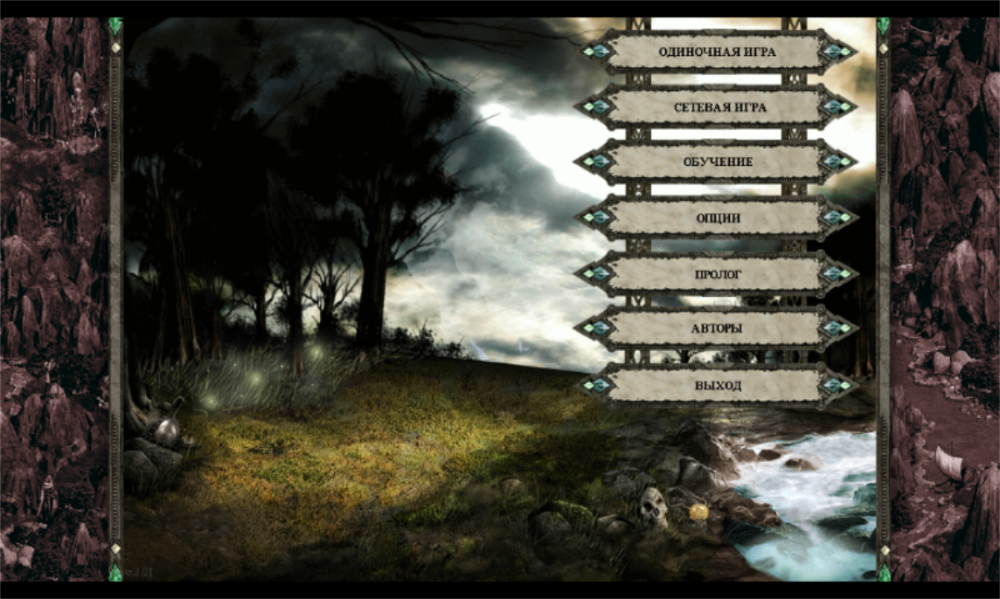

# Disciples II: Gold на Raspberry Pi 4 — установка и полная русификация

Установка Windows-игры **Disciples II: Gold** (Strategy First, 2005) на Raspberry Pi 4
под Wine — и её **полная русификация**: русский текст, озвучка героев, видеоролики,
кампании. Всё выполняется на самой малине, без Windows и без второго компьютера.

Проверено на Raspberry Pi 4 Model B, Debian 13 (trixie), окружение labwc + Wayland
(XWayland). Экран — телевизор по HDMI (1360x768) плюс встроенная панель 800x480.



## Что получается в итоге

- Игра запускается в полноэкранном режиме, картинка чистая (без розовых текстур).
- **Текст полностью русский**: меню, интерфейс, описания кампаний, истории, титры.
- **Озвучка героев русская**, видеоролики (вступление, сюжетные, титры) — русские.
- 11 кампаний, часть с русскими названиями.
- Звук без щелчков, работают два экрана одновременно.

## Три правила, без которых не получится

Это главное, что стоит прочитать целиком — на них ушла вся отладка.

### 1. Версия русификатора должна совпадать с версией игры

Сборка GOG — это **Gold 3.01**. Русский пакет обязан быть **от той же версии 3.01**.
Пакет от версии 2.01 внешне выглядит подходящим, но несовместим: игра с ним **вообще
не запускается** (процессов ноль), а если подменить файлы при работающей игре — получаешь
абракадабру шрифтов и вылеты.

Проверка занимает 30 секунд и делается **до** установки: сравниваются заголовки DBF-файлов.
У версии 3.01 в `Globals/Gunits.dbf` — 359 записей и 321 байт на запись. Совпало — версия та же.
Скрипт `04-russianize.sh` делает это сам и предупреждает, если версии разошлись.

### 2. Игру нужно закрыть перед подменой файлов

Подмена файлов на запущенной игре портит её: появляются «иероглифы» вместо текста,
игра вылетает. Все скрипты останавливают игру принудительно и **проверяют, что процессов
ноль**, и только потом меняют файлы. Если не удалось остановить — работа прерывается.

### 3. Регистр имён файлов — ловушка, из-за которой часть текста остаётся английской

Linux различает регистр в именах файлов, Windows — нет. Русский пакет приносит файл
`Sinfo.dbf`, а в игре уже лежит `Sinfo.DBF` — и это **два разных файла**. Игра читает
тот, что с большими буквами (английский), а русский спокойно лежит рядом и не используется.

Симптом: интерфейс и меню русские, а титры, истории кампаний и часть сообщений — английские.

Лечение: найти все пары, различающиеся только регистром, определить в каждой английский
файл (тот, где нет кириллицы, при непустом русском соседе) и удалить его. Делает
`scripts/07-ru-case-fix.py`. В этой игре так пришлось убрать пять файлов:
`Interf/TApp.DBF`, `Scens/Tscen.DBF`, `Scens/Sinfo.DBF`, `Globals/Tplayer.DBF`, `Globals/TAiMsg.DBF`.

## Быстрая установка

Полная пошаговая инструкция с готовым кодом всех файлов — в **[INSTALL.md](INSTALL.md)**.

Кратко, на малине:

```bash
git clone https://github.com/Haidegger22/pi4-disciples2-russian.git
cd pi4-disciples2-russian/scripts
./01-install-hangover.sh              # Wine под arm64 (Hangover)
./02-install-game.sh ~/d2-setup       # распаковка данных игры (без запуска установщика)
./03-install-mod.sh                   # мод, убирающий розовые текстуры
./04-russianize.sh                    # русский текст, озвучка, ролики
./05-audio-buffer.sh                  # убирает щелчки в звуке
./06-screens.sh                       # телевизор слева, панель справа
./08-check.sh                         # проверка: что установлено и на каком языке
```

Запуск игры — `./disciples2.sh` (его же стоит повесить ярлыком на рабочий стол).

## Что важно знать про железо и окружение

- **Почему Hangover, а не обычный Wine.** Связка `box64` + готовая сборка Wine (Kron4ek
  и подобные) графику не даёт: программы запускаются, консоль работает, но окно не
  создаётся — Wine замирает на создании служебных окон. Hangover — это Wine, собранный
  под arm64: эмулируется только само приложение, всё остальное исполняется нативно.
- **Игре нужно минимум 800x600.** У встроенной панели физически только режим 800x480,
  поэтому на время игры лаунчер поднимает масштаб до **0.8** — логически 1003x602, а окно
  игры уменьшено до 1000x600 и помещается целиком. При выходе масштаб снимается, и система
  возвращается к нормальным 800x480: работать в мелком интерфейсе не нужно. Телевизор решает
  вопрос напрямую. Если картинка по краям обрезается — уменьшите масштаб до 0.75 в лаунчере
  (будет 1066x640, картинка мельче, запаса больше).
- **Игра открывается на экране с координатами 0,0.** Если телевизор выключен, его выход
  исчезает, и система оставляет встроенную панель на позиции 1360 — окно уезжает за
  границу видимой области (звук идёт, а игры не видно). Лечится запуском `06-screens.sh`
  заново и перезапуском игры. Включайте телевизор **до** старта игры.
- **Щелчки в звуке** — от малого буфера PipeWire (игра работает на 22 кГц). Лечится
  увеличением кванта до 2048 в пользовательском конфиге (`05-audio-buffer.sh`).
- **«Ползунок громкости не влияет на игру»** — сначала проверить, какой выход активен:
  `pactl get-default-sink`. У нас звук шёл через Bluetooth-колонку (громкость 100%), а крутили
  громкость встроенного аудио (18%) — отсюда ощущение, что ползунок и mute не действуют.
  Игра использует Miles Sound System и в Wine идёт через `winepulse`, так что системная
  громкость ей подчиняется — регулировать надо текущий выход (`10-audio.sh`).
- **Bluetooth-колонка и громкость**: аппаратной регулировки у таких колонок обычно нет,
  работает программная — она управляется штатно. Схема с `module-combine-sink` не нужна:
  PipeWire отдаёт громкость Bluetooth сам.
- **Сохранения не работают** («Ошибка при сохранении игры») — в каталоге игры нет папки
  `SaveGame`. Русский пакет её приносит, но при ручной установке её легко потерять.
  Создаётся вручную: `mkdir -p ~/.wine-disciples/drive_c/Disciples2/SaveGame`.
- **Скорость боя и карты.** Настройка скорости в игровом меню на мод **не влияет**: меню
  пишет в секцию `[Settings]`, а мод читает `[Wrapper]` в `Disciple.ini`. Шкала у мода 1–20,
  но рабочая зона в начале: 1 — медленно, 10 и 20 — уже быстро. Меняется скриптом
  `09-game-speed.sh` (`battle 2`, `map 5`), применяется после перезапуска игры.
  Плюс есть хоткей смены скорости в бою — по умолчанию клавиша 7.

## Где взять русский пакет

Готового «русификатора» одним файлом не существует: берётся русское издание игры
(например, «Disciples II: Восстание Эльфов» версии 3.01) и из его данных ставятся
только файлы локализации. Исполняемые файлы и библиотеки из пакета копировать **нельзя** —
они от старой сборки и откатят мод, вернув розовые текстуры.

Скрипт `04-russianize.sh` ожидает распакованный пакет в `~/d2-ru-pack`. Что внутри:
`Globals`, `Interf`, `Scens`, `ScenData`, `Exports`, `Sounds`, `Campaign`, `Video`, `Briefing`.

## Откат

Каждый шаг сохраняет копии того, что заменяет:

```bash
# вернуть русские файлы на английские
cp -a ~/d2-backup-rus/. ~/.wine-disciples/drive_c/Disciples2/
# вернуть исполняемые файлы (откат мода)
cp -a ~/d2-backup-mod/. ~/.wine-disciples/drive_c/Disciples2/
# вернуть английские двойники регистра
cp -a ~/d2-backup-case/. ~/.wine-disciples/drive_c/Disciples2/
```

## Лицензия

Скрипты — MIT. Игра и её данные правами не сопровождаются: нужна легальная копия.
